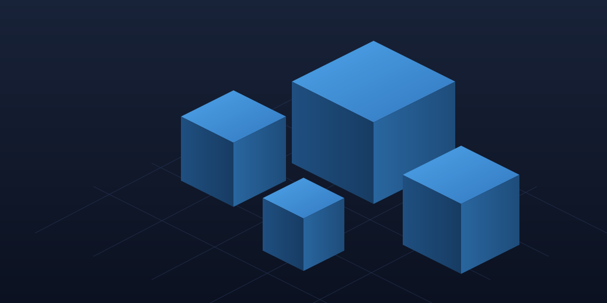

# Data Center Simulator


> **Un simulateur de gestion de data center dans ton garage : achète des serveurs d'occasion, installe des OS, refroidis la salle et fais tourner ton business.**
> *Sous le nom de code « Mes Data Centers ». Développé avec Godot 4.7.*

---

## Aperçu


## Fonctionnalités
- **Garage interactif en vue de dessus** : déplace ton personnage (WASD/ZQSD), pose les équipements où tu veux avec les cases vertes au clic.
- **Boutique Tech'Occase** : un vrai faux site e-commerce dans le navigateur « Renard » du PC — serveurs d'occasion, armoires, batteries, climatiseurs, abonnements internet, pare-feu et locaux.
- **Économie réaliste** : clients qui se connectent, factures d'électricité et de connexion déduites chaque seconde, température du local qui grimpe (au-delà de 50 °C, les serveurs s'arrêtent !).
- **Deux locaux** : le garage DC-1 (établi, livraison, cour) et le Local 2 « Data Hall » (PC Pro, établi 2 baies, armoires 4 slots) — déplace-toi en voiture.
- **Supervision en direct** : le site MONITOR affiche connexion, clients, saturation et température en temps réel.
- **Sauvegarde complète** : plusieurs emplacements, chaque local garde son infrastructure.

## Tech Stack
| Technologie | Usage |
| :--- | :--- |
|  | Logique principale du jeu |
|  | Moteur / Interface / Scènes |
|  | Emplacements de sauvegarde |

## Installation & Lancement

1. **Cloner le projet**
   ```bash
   git clone https://github.com/BlackAngelTVdev/DataCenter-Simulator.git
   cd DataCenter-Simulator
   ```
2. **Installer Godot 4.7**
   Téléchargez l'éditeur Godot **4.7 stable** depuis [godotengine.org](https://godotengine.org/download) et installez-le.
3. **Ouvrir le projet**
   Lancez Godot, cliquez sur **Import** puis sélectionnez le fichier `project.godot` du dossier cloné.
4. **Lancer le jeu**
   ```
   Appuyez sur F5 (ou cliquez sur Play)
   ```
   Les textures sont pré-cuites dans `assets/images/baked/` — aucun outil de régénération nécessaire.

## Utilisation
Au lancement, vous arrivez sur le menu principal (Reprendre, Mes Sauvegardes, Options, Quitter).

En jeu, le but est simple : **acheter son premier serveur sur Tech'Occase** (PC du garage -> Renard), le récupérer à la livraison, **installer un OS à l'établi** (Deblon / Ouboutou = dédié, Proxmousse = VPS), puis le poser au sol pour commencer à encaisser. Faites attention à la chaleur : posez des climatiseurs avant que la salle ne dépasse 50 °C !

```
// Exemple de boucle de jeu
Acheter un serveur -> Installer un OS -> Le poser -> Clients arrivent -> Revenus $/s
                          ^                                v
              Refroidir le local (clims) <- La chaleur monte
```

## Contribution
1. Forkez le projet
2. Créez votre branche (git checkout -b feature/AmazingFeature)
3. Commit (git commit -m 'Add some AmazingFeature')
4. Push (git push origin feature/AmazingFeature)
5. Ouvrez une Pull Request

## Auteur

**BlackAngelTVdev**


---
## Licence

Ce projet est sous licence :


> Aucun fichier LICENSE n'est encore fourni. Contactez l'auteur avant toute utilisation commerciale.

### Contributors

Merci à toutes les personnes qui contribuent au projet.

[](https://github.com/BlackAngelTVdev/DataCenter-Simulator/graphs/contributors)
